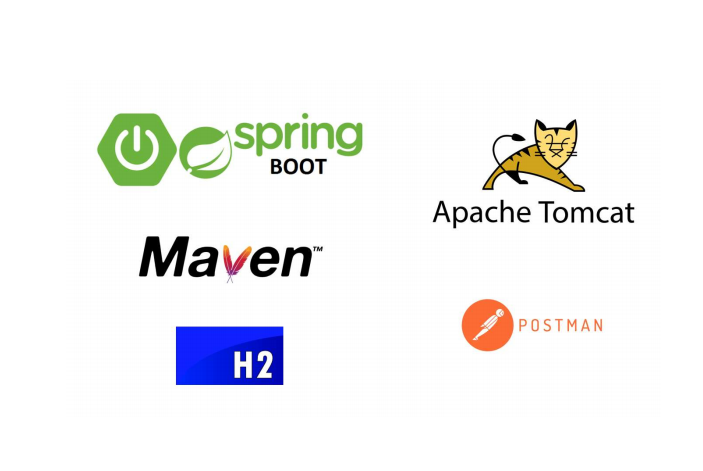

<h1 align="center"> Projeto web services com Spring Boot e JPA / Hibernate  </h1>

  <div align="center">
    
  </div>

<h2> Sobre </h2>
  
  Esse é um projeto de Spring boot e JPA/Hibernate do curso <b>Java COMPLETO Programação Orientada a Objetos </b> do Dr. Nelio Alves,
  <a href="https://www.udemy.com/course/java-curso-completo/"> Curso Udemy </a>. Projeto Backend de um controle de pedidos. O cliente faz o pedido em seguida
  é feito o pedido de venda contento os produtos que foram pedidos pelo cliente.
  
  This is a Project of Spring Boot and JPA/Hibernate of course  <b>Java COMPLETO Programação Orientada a Objetos </b> of Dr. Nelio Alves,
  <a href="https://www.udemy.com/course/java-curso-completo/"> Course Udemy</a>. Project Backend of a control of order. The Client make a order then is fulfil the
  order include the prodcut that was order by Client.
 
 <h2> Tecnologias utilizadas </h2>
  <u1>
    <li><a href="https://www.oracle.com/java/technologies/javase/jdk15-archive-downloads.html"> JDK 15 </a> : Java Development Kit 15 - um kit de desenvolvimento para 
    construção de aplicações e componentes usando a linguagem de programação Java;</li>
    <li><a href="https://netbeans.apache.org/download/index.html"> NetBeans</a> : O NetBeans IDE é um ambiente de desenvolvimento integrado gratuito e de código aberto 
    para desenvolvedores de software nas linguagens Java.</li>
    <li><a href="https://spring.io/"> Spring Boot </a> : O Spring é um framework open source para a plataforma Java criado. Trata-se de um framework não intrusivo,
    baseado nos padrões de projeto inversão de controle (IoC) e injeção de dependência.</li>
    <li><a href="http://tomcat.apache.org/"> Apache Tom Cat </a> : O Tomcat é um servidor web Java, mais especificamente, um container de servlets.</li>
    <li><a href="https://maven.apache.org/"> Maven </a> : Apache Maven, ou Maven, é uma ferramenta de automação de compilação utilizada primariamente em projetos Java.</li>
    <li><a href="https://www.h2database.com/html/main.html"> Banco de Dados h2 </a> :SQL database em memoria, para testes</li>
    <li><a href="https://www.postman.com/downloads/"> Postman </a> :  Ferramenta que executa testes de APIs e requisições em geral.</li>
    <li><a href="https://www.postgresql.org/download/"> PostgreSQL </a> : È um sistema gerenciador de banco de dados objeto relacional </li>
    <li><a href="https://dashboard.heroku.com/apps"> Heroku </a> : È uma plataforma em nuvem como um serviço que suporta várias linguagens de programação.</li>
  </u1> 
  
  <h3> Intalacao </h2>
  
  Para baixar o código-fonte do projeto em sua máquina, primeiramente voce terá que ter instalado em seu computador o <a href="https://git-scm.com/"> GIT </a>.

  Com o Git instalado, em seu terminal execute o seguinte comando:
  
  ```
  $ git clone https://github.com/jonasmachados/courseSpringBOOTJava15
  ```
  Com o projeto baixado, Instale o Postman:
  
  ```
  https://www.postman.com/downloads/
  ```
  Instale o PostGreSQL
  
   ```
   https://www.postgresql.org/download/
   ```
   Use a porta padrao do PostgreSQL
   
   ```
   5432
   ```
   <h2> Author: </h2>

    * **Dr. Nelio Alves** 
 
  
  
  
